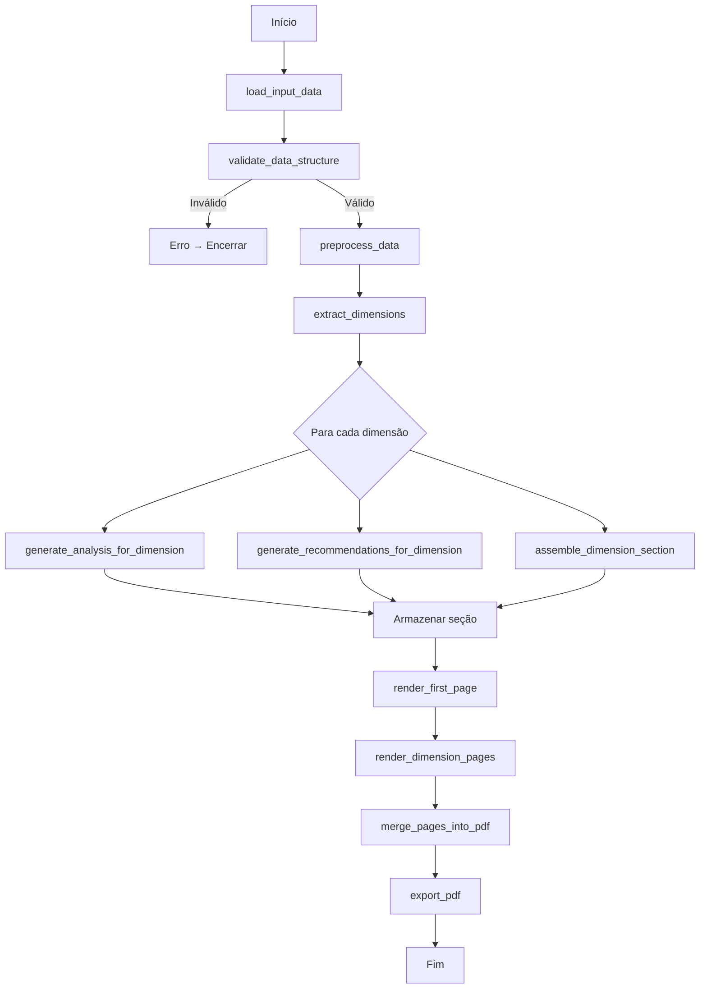

Claro! Aqui está um **README.md completo**, já incluindo:

✔ Descrição do projeto
✔ Arquitetura do sistema
✔ Lista das funções + inputs/outputs
✔ Fluxograma Mermaid
✔ Estrutura do relatório
✔ Exemplos
✔ Sessões organizadas e prontas para uso no GitHub

Se quiser, eu também posso gerar uma versão em inglês ou adicionar badges (build, license, version).

---

# 📘 **Gerador de Sumários Executivos**

Este repositório contém um robô capaz de produzir **sumários executivos automatizados** a partir de dados fornecidos pelo usuário.
O sistema gera **PDFs padronizados**, com a **primeira página fixa** (baseada no modelo institucional) e as páginas seguintes estruturadas sempre no formato:

> **Dados → Análise → Recomendações**

O objetivo é tornar a produção de relatórios institucionais **mais rápida, consistente e inteligente**, integrando dados, análise e geração automática de documentos.

---

# 🧩 **Funcionalidades**

* 🧠 Geração automática de análises textuais com IA
* 📄 Primeira página fixa baseada no modelo enviado
* 📊 Estrutura padronizada por dimensão
* 🔍 Suporte a múltiplos conjuntos de dados
* 🛠 Integração entre dados, texto e exportação de PDF
* 📈 Adequado para relatórios institucionais, acadêmicos e administrativos

Modelo de referência utilizado:
📄 **[Matemática] Sumário Executivo.pdf** (arquivo enviado pelo usuário)

---

# 🧱 **Arquitetura do Algoritmo**

Esta é a visão geral do sistema, com **funções, entradas, saídas e responsabilidades**.

## 📌 Funções do Sistema

| Função                                         | Input                           | Output                  | Descrição                                                           |
| ---------------------------------------------- | ------------------------------- | ----------------------- | ------------------------------------------------------------------- |
| **`load_input_data()`**                        | arquivo/dados brutos            | dados estruturados      | Lê a entrada (JSON/CSV/etc.) e converte para estrutura padronizada. |
| **`validate_data_structure()`**                | dados carregados                | válido/inválido + erros | Verifica integridade, campos obrigatórios e formatos.               |
| **`preprocess_data()`**                        | dados validados                 | dados tratados          | Normaliza indicadores, limpa valores e organiza dados.              |
| **`extract_dimensions()`**                     | dados tratados                  | lista de dimensões      | Identifica blocos de dados por dimensão do relatório.               |
| **`generate_analysis_for_dimension()`**        | dados da dimensão               | texto de análise        | Interpreta os indicadores e gera análise textual.                   |
| **`generate_recommendations_for_dimension()`** | dados + análise                 | recomendações           | Produz recomendações coerentes com os dados.                        |
| **`assemble_dimension_section()`**             | dados + análise + recomendações | seção final             | Monta o bloco: **Dados → Análise → Recomendações**.                 |
| **`render_first_page()`**                      | metadados institucionais        | página 1 renderizada    | Gera a capa fixa do relatório.                                      |
| **`render_dimension_pages()`**                 | seções montadas                 | páginas em PDF          | Constrói as páginas das dimensões.                                  |
| **`merge_pages_into_pdf()`**                   | páginas individuais             | PDF final               | Junta todas as páginas geradas.                                     |
| **`log_execution()`**                          | eventos                         | —                       | Registra informações úteis para auditoria e debug.                  |
| **`export_pdf()`**                             | PDF final + destino             | arquivo salvo           | Salva o PDF no sistema de arquivos.                                 |

---

# 🗺️ **Fluxograma Geral do Algoritmo**

Representação visual em **Mermaid**, totalmente compatível com GitHub:



---

# 📂 **Estrutura do Relatório Gerado**

O PDF final segue uma organização padronizada:

## **📄 Página 1 (Fixa — Template institucional)**

* Identidade visual
* Nome do curso e instituição
* Propósito do relatório
* Explicação das dimensões
* Modelo de Mapa Estratégico
* Observações adicionais

## **📑 Páginas Seguintes (Geradas automaticamente)**

Para cada dimensão:

1. **Dados:** apresentação objetiva dos indicadores
2. **Análise:** interpretação gerada pela IA
3. **Recomendações:** propostas de ação e melhoria

---

# 📝 **Exemplo de Entrada (JSON)**

```json
{
  "curso": "Matemática",
  "periodo": "2025.1",
  "dimensoes": [
    {
      "nome": "Estudantes",
      "dados": {
        "ocupacao": 62.2,
        "diplomacao": 10.5
      },
      "observacoes": "Coorte 2015–2017"
    }
  ]
}
```

---

# 📦 **Saída Esperada**

* Um arquivo PDF contendo:

  * 📘 Primeira página padrão
  * 🧩 Seções organizadas por dimensão
  * 🧠 Textos analíticos e recomendações geradas dinamicamente

---

# 🛠️ **Exemplo de Execução (planejado)**

```bash
python gerar_relatorio.py dados.json --output sumario.pdf
```

Ou com parâmetros adicionais:

```bash
python gerar_relatorio.py \
  --input dados_sara.json \
  --modelo template_primeira_pagina.pdf \
  --saida relatorio_final.pdf
```

---

# 🤝 Contribuições

Contribuições são bem-vindas!
Abra um *issue* ou envie um *pull request*.

---

# 📜 Licença

Licença **MIT** — uso livre com créditos.

---

# 🧑‍💻 Autor

Desenvolvido como parte de uma iniciativa do
**Núcleo de Análise de Dados e Desempenho (A²D)** / **LEAD**
para automação inteligente de relatórios institucionais.

---

Se quiser, eu posso:

✨ Criar uma imagem/banner para o topo do README
✨ Criar badges (licença, versão, status)
✨ Criar uma logo simples para o robô
✨ Montar o README em inglês também

Só pedir!
